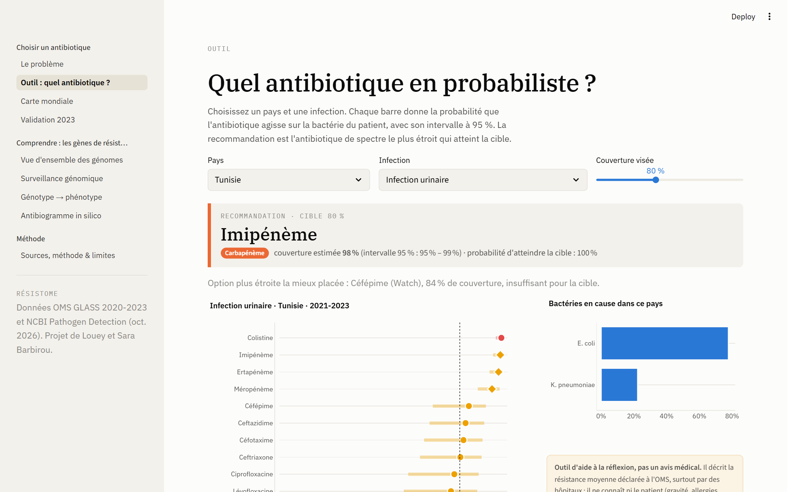
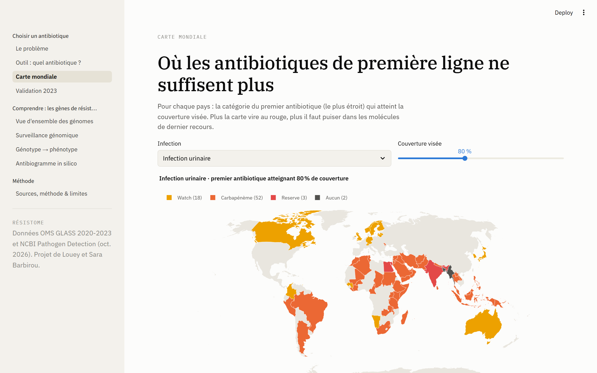
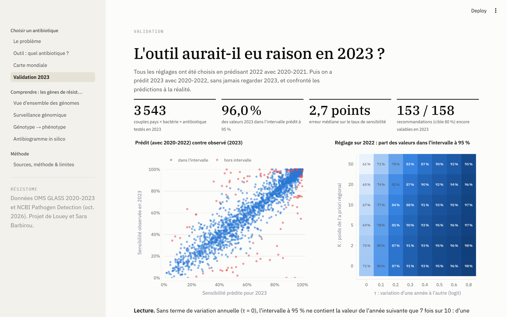
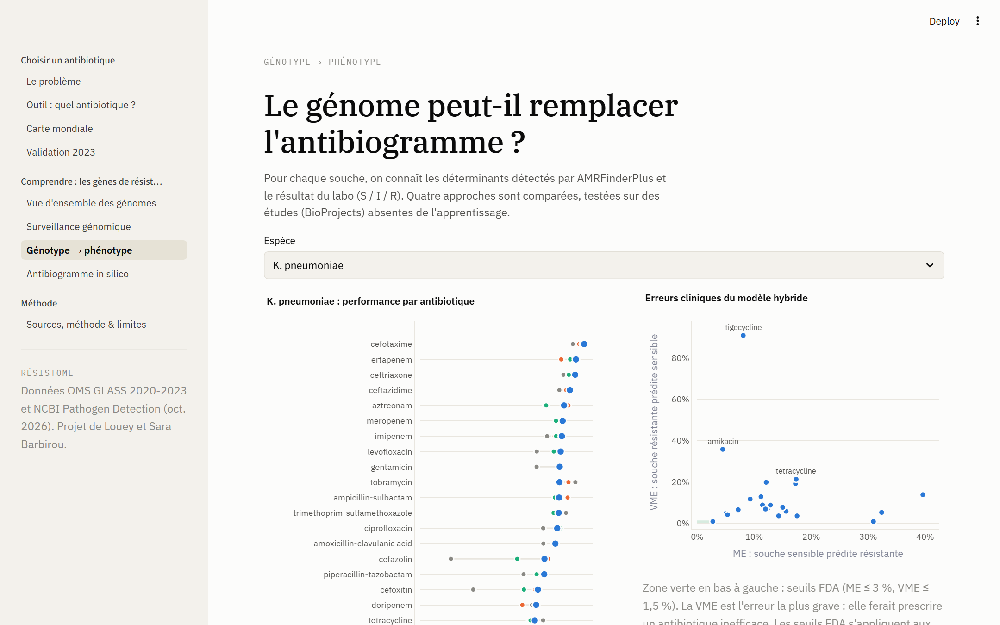

# Résistome

**Choisir le bon antibiotique quand il n'y a pas d'antibiogramme.**

Projet réalisé par **Louey Barbirou** (M1 Expert IA, Ynov) avec **Sara Barbirou**, étudiante en
Cursus Master en Ingénierie (CMI), immunologie.



## Le problème

La résistance aux antibiotiques a causé directement **1,14 million de décès en 2021**
(GRAM, *The Lancet*, 2024). En 2023, **une infection bactérienne sur six** dans le monde était
résistante, et **une sur trois** pour les infections urinaires (OMS, rapport GLASS 2025).

Face à une infection, un antibiogramme demande 48 à 72 heures de culture, et beaucoup d'hôpitaux
n'en réalisent pas du tout. En attendant, le médecin prescrit un antibiotique **probabiliste**,
souvent par habitude. Deux erreurs sont possibles :

- choisir un antibiotique auquel les bactéries locales résistent déjà : le traitement échoue ;
- prendre par réflexe un antibiotique de dernier recours (carbapénème, colistine) : il marche,
  mais chaque prescription inutile accélère l'apparition de bactéries qui y résistent.

## Ce que fait Résistome

Pour un **pays** et une **infection** (infection urinaire, bactériémie à bacille Gram négatif,
dysenterie, gonorrhée), Résistome estime pour chaque antibiotique sa **couverture** : la probabilité
qu'il agisse sur la bactérie, encore inconnue, du patient. Puis il recommande l'antibiotique de
**spectre le plus étroit** qui atteint la couverture visée (80 % par défaut), dans l'ordre de la
classification **AWaRe** de l'OMS : Access, puis Watch, puis carbapénèmes, puis Reserve.

Le scénario visé est réaliste même dans un petit laboratoire : une coloration de Gram (quelques
minutes, très peu coûteuse) dit si la bactérie est un bacille Gram négatif, mais pas à quoi elle
résiste.

## Les données

| Source | Contenu | Usage |
|---|---|---|
| [OMS GLASS](https://worldhealthorg.shinyapps.io/glass-dashboard/) | Par pays, bactérie, antibiotique et année (2020-2023) : infections testées et résistantes. 109 pays, 14 768 lignes | Couverture des antibiotiques |
| [Classification AWaRe 2025](https://iris.who.int/handle/10665/382244) (OMS) | Access / Watch / Reserve | Ordre de préférence |
| EUCAST, *Expected resistant phenotypes* | Résistances naturelles (ex. Klebsiella et ampicilline) | Couverture nulle imposée |
| [NCBI Pathogen Detection](https://www.ncbi.nlm.nih.gov/pathogens/) + [AMRFinderPlus](https://github.com/ncbi/amr) | 1,7 million de génomes, leurs gènes de résistance et 25 433 antibiogrammes de labo | Partie « comprendre » |

Le dashboard GLASS n'a pas d'API. `scripts/download_glass.py` le pilote avec Playwright et
**vérifie chaque fichier** (bactérie, infection, année écrites dans l'en-tête). Cette vérification
a révélé que, sans attendre la fin du rafraîchissement du serveur, une partie des téléchargements
contenait les données de la sélection précédente.

## La méthode

**Antibiogramme syndromique pondéré** (WISCA ; Hebert et al. 2012, version bayésienne de
Bielicki et al. 2016) :

```
couverture(antibiotique | pays, infection) =
    Σ  P(bactérie | infection, pays)  ×  P(sensible | bactérie, antibiotique, pays)
```

- **P(sensible)** : loi Beta a posteriori. Les données du pays mettent à jour un a priori tiré de sa
  région OMS, d'un poids de K souches. Un pays avec 12 tests est ainsi ramené vers sa région au lieu
  d'afficher un 100 % fragile.
- **Variation annuelle** : d'une année à l'autre, ce ne sont pas les mêmes hôpitaux qui déclarent.
  Un terme τ sur l'échelle logit l'intègre ; sans lui, les intervalles sont faussement étroits.
- **P(bactérie)** : loi de Dirichlet sur le nombre d'infections testées par bactérie.
- **Prudence** : une bactérie que l'OMS ne documente pas pour un antibiotique est comptée comme
  non couverte. Au-delà de 20 % de cas non documentés, l'antibiotique est déclaré « données
  insuffisantes » au lieu d'afficher un chiffre trompeur.
- 4 000 tirages Monte-Carlo donnent la médiane et l'intervalle à 95 % de chaque couverture.

## Les résultats

**Avec une cible de 80 % de couverture, données 2021-2023 :**

| Infection | Pays | Premier choix Watch | Carbapénème | Reserve | Aucun |
|---|---|---|---|---|---|
| Infection urinaire | 75 | 18 | **52** | 3 | 2 |
| Bactériémie à Gram négatif | 97 | 21 | 24 | **41** | 11 |

Aucun pays n'atteint 80 % avec un antibiotique **Access** pour ces deux infections, parmi ceux que
l'OMS suit. Pour une infection urinaire, dans 7 pays sur 10, le premier antibiotique qui couvre 80 %
des cas est un carbapénème.

**Exemple, Tunisie.** Bactériémie à Gram négatif : seule la colistine (Reserve) atteint 80 %
(85 %). Klebsiella et Acinetobacter, très résistants, causent près de trois cas sur quatre ; les
carbapénèmes plafonnent entre 55 et 70 %. Infection urinaire : le céfépime atteint 84 % en médiane,
mais avec trop d'incertitude pour garantir la cible ; l'outil remonte donc jusqu'à l'imipénème (98 %).



## La validation

Tous les réglages (K, τ) ont été choisis en **prédisant 2022 avec 2020-2021**. Puis on a prédit
**2023 avec 2020-2022**, sans jamais regarder 2023.

| Contrôle sur 2023 | Résultat |
|---|---|
| Valeurs 2023 dans l'intervalle prédit à 95 % (3 543 couples pays × bactérie × antibiotique) | **96,0 %** |
| Erreur médiane sur le taux de sensibilité | 2,7 points |
| Recommandations (cible 80 %) encore valables en 2023, à 5 points près | **153 sur 158** |

Sans terme de variation annuelle, l'intervalle à 95 % ne contenait la valeur de l'année suivante
que 7 fois sur 10.

Limite assumée : pour les couples peu documentés (moins de 100 souches), l'a priori régional ne
réduit pas l'erreur ponctuelle (6,9 points contre 6,2 avec les seules données du pays). Son apport
est d'éviter des intervalles faussement étroits.



## Les limites

- **Ce n'est pas un avis médical.** L'outil décrit la résistance moyenne déclarée à l'OMS. Il ne
  connaît ni le patient (gravité, allergies, grossesse, fonction rénale), ni l'écologie d'un service.
  Les recommandations nationales et l'antibiogramme priment.
- Les données GLASS viennent surtout de laboratoires hospitaliers : elles surestiment la résistance
  des infections communautaires simples (cystite de la femme jeune, par exemple).
- L'OMS ne suit pas plusieurs antibiotiques de première ligne : nitrofurantoïne, fosfomycine,
  pivmécillinam, et aminosides pour E. coli et Klebsiella. Ils ne peuvent pas être évalués.
- Les associations (ex. ceftriaxone + amikacine) ne sont pas modélisées : il faudrait connaître
  les co-résistances, que les données agrégées ne donnent pas.

## Comprendre : les gènes derrière la résistance

La seconde partie du projet explique **pourquoi** ces bactéries résistent, à partir de
1,7 million de génomes publics (NCBI Pathogen Detection).

- La carbapénémase **NDM** passe de 5,4 % à **29,1 %** des génomes de *Klebsiella* séquencés entre
  2010-14 et 2021-25 ; **KPC** recule de 39,0 % à 28,3 %.
- Le gène **mcr** (résistance à la colistine) est **5 fois plus fréquent** dans les *E. coli* d'origine
  porcine que d'origine humaine (6,7 % contre 1,3 %).
- **Peut-on lire l'antibiogramme dans le génome ?** 97 modèles espèce × antibiotique, validés étude par
  étude (BioProject) pour éviter les souches clonales. Un LightGBM seul ne bat pas la règle experte
  (0,887 contre 0,893 d'exactitude équilibrée) ; un modèle **hybride** qui reçoit aussi la classe
  de chaque gène fait jeu égal (0,898) avec moins de fausses alertes. Seuls 4 couples sur 97 passent
  les seuils de la FDA.
- **Audit qualité** : l'étude PRJNA1322038 déclare 100 % de *Klebsiella* sensibles à l'ampicilline,
  une espèce naturellement résistante. Ses 535 souches ont été mises en quarantaine.

Les antibiogrammes NCBI viennent de 391 études ; les principales sont FDA NARMS (*Salmonella*,
*E. coli*), le Walter Reed Army Institute of Research, l'Agence canadienne d'inspection des aliments,
des laboratoires de santé publique du réseau GenomeTrakr, le Brigham & Women's Hospital et
l'Université de Liverpool.



## Lancer le projet

```bash
pip install -r requirements.txt
streamlit run app/app.py          # lit data/app/ et models/ (versionnés)
```

Reconstruire depuis les sources :

```bash
pip install -r requirements-pipeline.txt && playwright install chromium
python scripts/download_glass.py  # OMS GLASS (≈ 40 min, fichiers vérifiés)
python src/wisca.py               # réglage, couvertures, validation 2023
bash download.sh                  # génomes NCBI (≈ 1,7 Go)
python src/ingest.py && python src/aggregate.py && python src/model.py
python scripts/screenshots.py     # captures (app lancée sur :8531)
```

| Fichier | Rôle |
|---|---|
| `scripts/download_glass.py` | Téléchargement vérifié des données OMS GLASS |
| `src/wisca.py` | Couverture bayésienne, recommandation AWaRe, réglage et validation |
| `src/ingest.py`, `src/aggregate.py` | Génomes NCBI → Parquet, agrégats de surveillance |
| `src/model.py`, `src/amr_rules.py` | Génotype → phénotype, audit qualité |
| `app/` | Dashboard Streamlit (`tool_pages.py` pour l'outil, `ui.py` pour le style) |

Stack : Python, pandas, NumPy, DuckDB, scikit-learn, LightGBM, SHAP, Playwright, Plotly, Streamlit.
